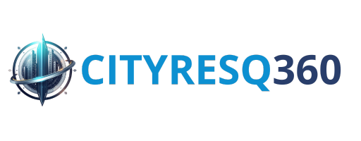
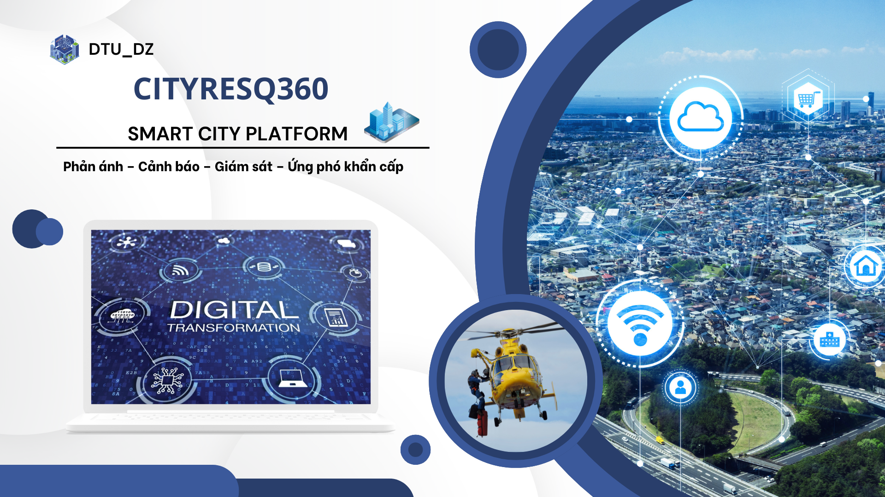
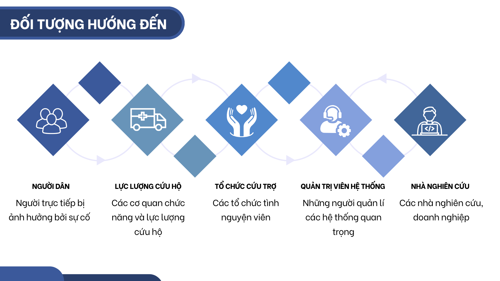
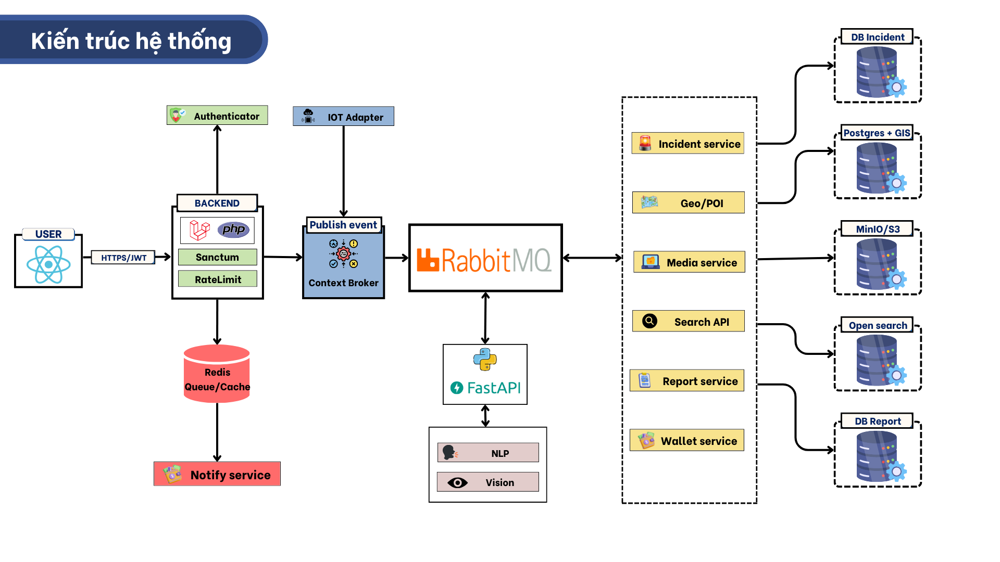

# 🌆 CityResQ360 — Chung tay vì một đô thị thông minh & an toàn

<div align="center">
  
  
  <br/>
  
  <a href="https://api.cityresq360.io.vn/">
    
  </a>
  <a href="https://nguyenthai11103.github.io/DTU-CityResQ360-documents/intro">
    
  </a>
  <a href="https://api.cityresq360.io.vn/documents">
    
  </a>
  
  <br/>
  
  <a href="LICENSE">
    
  </a>
  
  <br/>
  
  <a href="CONTRIBUTING.md">🤝 Đóng Góp</a> •
  <a href="CHANGELOG.md">📜 Changelog</a>

</div>



> _"Kết nối người dân - Chính quyền - Công nghệ"_

## 📖 Tổng Quan

**CityResQ360** là một dự án mã nguồn mở, được phát triển bởi đội **DTU-DZ** đến từ **Đại học Duy Tân** để tham gia cuộc thi **Olympic Tin học Sinh viên - Phần mềm nguồn mở năm 2025**. Dự án được thiết kế trong lĩnh vực **xây dựng đô thị thông minh và an toàn hỗ trợ chuyển đổi số**, với các mục tiêu:

🔗 **Kết nối người dân - chính quyền - công nghệ** một cách hiệu quả  
📊 **Quản lý và xử lý sự cố đô thị** một cách chuyên nghiệp  
💡 **Mang lại sự an toàn** cho cộng đồng thành phố  
📝 **Minh bạch dữ liệu** trong quá trình phản ánh và xử lý sự cố

Dự án tập trung vào việc xây dựng một nền tảng toàn diện, kết hợp công nghệ hiện đại như **AI**, **IoT**, **Blockchain** và xử lý dữ liệu thời gian thực để tạo ra một hệ sinh thái đô thị thông minh minh bạch và hiệu quả.

---

## 👥 Đối tượng hướng đến



1. **Người dân:** Gửi phản ánh cực nhanh (kèm ảnh, vị trí), nhận cảnh báo nguy hiểm, và tích điểm **CityPoint** đổi quà.
2. **Cơ quan chức năng:** Có công cụ quản lý trực quan, nắm bắt ngay các điểm nóng để điều phối xử lý.
3. **Tình nguyện viên / NGO:** Dễ dàng tiếp cận thông tin để hỗ trợ cộng đồng.

---

## ✨ Modules chính của CityResQ360

### 1. 📱 Module tương tác người dân

- ⚠️ Gửi phản ánh (ảnh + GPS + mô tả)
- 👁️‍🗨️ Theo dõi tiến trình xử lý realtime
- 📢 Nhận cảnh báo nguy hiểm

### 2. 🤖 Module phân tích và phân loại

- 📸 AI Vision: nhận diện cháy, tai nạn, ngập, rác, kẹt xe
- 📝 AI NLP: phân loại mô tả tiếng Việt
- ⭐ Đánh giá mức độ khẩn cấp tự động
- 📃 Hợp nhất dữ liệu ảnh – text – vị trí

### 3. 🚨 Module Quản lý sự cố & Nguồn lực

- 📝 Tiếp nhận – phân công – xử lý tự động
- 🗺️ Bản đồ realtime hiển thị sự cố
- 🚓 Quản lý nhiệm vụ, phương tiện, lực lượng
- ⚠️ Cảnh báo và gộp sự cố trùng lặp

### 4. 📊 Module Quản trị hệ thống

- 📉 Dashboard tổng quan cho cơ quan
- 📂 Báo cáo KPI và thống kê
- ⚙️ Phân quyền và quản lý người dùng
- 📊 Cấu hình API, giám sát hệ thống

---

## 🗺️ Kiến Trúc Hệ Thống



Hệ thống được thiết kế theo kiến trúc Microservices hiện đại, đảm bảo khả năng mở rộng và xử lý dữ liệu lớn:

| Thành phần         | Công nghệ sử dụng                                                                      |
| :----------------- | :------------------------------------------------------------------------------------- |
| **Mobile App**     | `React Native` (IOS & Android)                                                         |
| **Web**            | `VueJS`                                                                                |
| **Backend Core**   | `Laravel` (PHP), `Redis` (Cache) ,`Laravel Sanctum` (API Auth)                         |
| **AI Services**    | `FastAPI` (Python) cho NLP & Computer Vision                                           |
| **Message Broker** | `RabbitMQ`, `MQTT` (EMQX/Mosquitto)                                                    |
| **Realtime**       | `Reverb` (WebSocket)                                                                   |
| **Database**       | `PostgreSQL` + `PostGIS` (GeoData), `MinIO` (Storage), `OpenSearch`,`MongoDB`, `MySQL` |

---

## 🪛 Service của CityResQ360

Xem chi tiết các service của CityResQ360 tại đây [Service docs](https://api.cityresq360.io.vn/).

Tài khoản demo hoặc có thể đăng kí

```
username: admin@master.com
password: 123456
```

## 🔗 Linked Open Data - NGSI-LD

**Yêu cầu kỹ thuật OLP 2025:** CityResQ360 tuân thủ chuẩn **NGSI-LD** (Next Generation Service Interfaces - Linked Data) do ETSI ban hành để chia sẻ dữ liệu mở về thành phố thông minh.

### Tại sao NGSI-LD?

- **Chuẩn quốc tế:** ETSI GS CIM 009 - Được sử dụng bởi FiWARE và các thành phố thông minh trên thế giới
- **Interoperability:** Dữ liệu có thể tích hợp với các hệ thống khác
- **Linked Data:** JSON-LD format hỗ trợ liên kết ngữ nghĩa giữa các nguồn dữ liệu
- **Open Data:** API công khai để nghiên cứu và phát triển ứng dụng bên thứ 3

### API Endpoints

```bash
# Lấy danh sách sự cố (Alert entities)
GET /api/ngsi-ld/v1/entities?type=Alert

# Lấy chi tiết một sự cố
GET /api/ngsi-ld/v1/entities/urn:ngsi-ld:Alert:123

# Tạo sự cố mới (JSON-LD format)
POST /api/ngsi-ld/v1/entities
Content-Type: application/ld+json
```

### Smart Data Models

Sử dụng **FiWARE Smart Data Models** - Alert:

- **category:** traffic, environment, infrastructure, publicService, safety, health
- **severity:** low, medium, high, critical
- **location:** GeoProperty (GeoJSON Point)
- **status:** pending, active, resolved, closed

📚 **Documentation:** Xem chi tiết tại [docs/NGSI-LD.md](docs/NGSI-LD.md)

---

## 🌱 Hướng phát triển

Dự án không chỉ dừng lại ở việc cải thiện tốc độ phản ánh sự cố mà còn hướng tới một hệ sinh thái đô thị thông minh toàn diện:

### 🌐 Mở rộng & Kết nối

- **Quy mô:** Triển khai đa thành phố, hỗ trợ đa ngôn ngữ (Quốc tế hóa).
- **Bản đồ số:** Tích hợp bản đồ chi tiết thời gian thực, hiển thị vùng nguy hiểm và đường di tản.

### 🧠 Nâng cấp AI & Dữ liệu

- **Dự đoán rủi ro:** Phân tích dữ liệu lịch sử và thời tiết để cảnh báo sớm thiên tai, ngập lụt.
- **Computer Vision:** Tự động nhận diện sự cố từ Camera giao thông và UAV.
- **Chatbot thông minh:** Hỗ trợ người dân tra cứu, sơ tán và báo cáo tự động 24/7.

### 🔒 Blockchain & Minh bạch

- **Smart Contract:** Lưu trữ hồ sơ phản ánh vĩnh viễn, không thể chỉnh sửa.
- **Token hóa CityPoint:** Chuyển đổi điểm thưởng thành token có giá trị thực tế trên mạng lưới Polygon/Ethereum.

---

---

## 🗂️ Cấu trúc dự án

```
CityResQ360-DTUDZ/
├── .github/                    # GitHub configurations
│   └── ISSUE_TEMPLATE/        # Issue templates
├── modules/                    #  All microservices & apps
│   ├── CoreAPI/               # Laravel 12 - Core API (Port 8000)
│   ├── AppMobile/             # Mobile App (React Native)
│   ├── CoreAPI/               # Core Laravel API (Port 8000)
│   ├── WalletService/         # Go Service - CityPoints Management (Port 8003)
│   ├── MediaService/          # Node.js - Media upload & processing (Port 8004)
│   ├── NotificationService/   # Node.js - Push notifications (Port 8005)
│   ├── IncidentService/       # Node.js - Incident tracking (Port 8006)
│   ├── IoTService/            # Node.js - IoT device management (Port 8007)
│   ├── AIMLService/           # Python - AI/ML models (Port 8008)
│   ├── SearchService/         # Python FastAPI - OpenSearch (Port 8009)
│   ├── FloodEyeService/       # Python - Flood prediction (Port 8010)
│   └── AnalyticsService/      # Python - Data analytics (Port 8011)
├── infrastructure/             # Infrastructure configurations
│   ├── docker/                # Docker Compose files
│   │   ├── docker-compose.yml              # Development
│   │   └── docker-compose.production.yml   # Production
│   ├── nginx/                 # Nginx configuration
│   └── mosquitto/             # MQTT Broker configuration
├── collections/                #  API Testing collections
│   └── postman/               # Postman collections
├── docs/                       #  Documentation
│   ├── PROJECT_CONTEXT.md     # Project architecture & context
│   ├── DEVELOPMENT_WORKFLOW.md # Development guidelines
│   └── DOCKER.md              # Docker setup guide
├── scripts/                    #  Utility scripts
│   ├── setup/                 # Setup scripts
│   ├── deploy/                # Deployment scripts
│   │   └── deploy.sh          # Main deployment script
│   └── migration/             # Migration & maintenance scripts
├── static/                     #  Static assets
│   └── img/                   # Images & diagrams
├── README.md                   # This file
├── LICENSE                     # GNU General Public License v3.0
├── CHANGELOG.md               # Version history
├── CODE_OF_CONDUCT.md         # Code of conduct
└── CONTRIBUITING.md           # Contribution guidelines
```

## 🛠️ Hướng dẫn cài đặt

### 🚀 Cài đặt nhanh với docker

**Yêu cầu**: Docker, Docker Compose, Git

```bash
# 1. Clone repository
git clone https://github.com/MNM-DTU-DZ/CityResQ360-DTUDZ.git
cd CityResQ360-DTUDZ

# 2. Cấu hình environment
cp modules/CoreAPI/.env.example modules/CoreAPI/.env

# 3. Tạo cấu hình MQTT
mkdir -p infrastructure/mosquitto/config
cat > infrastructure/mosquitto/config/mosquitto.conf << 'EOF'
listener 1883
allow_anonymous true
persistence true
persistence_location /mosquitto/data/
log_dest file /mosquitto/log/mosquitto.log
EOF

# 4. Khởi động hệ thống
cd infrastructure/docker
docker compose up -d

# 5. Chạy migrations
docker exec -it cityresq-coreapi php artisan migrate --seed
docker exec -it cityresq-coreapi php artisan key:generate
```

**Truy cập**:

- 🌐 CoreAPI: http://localhost:8000
- 📱 Web App: http://localhost:3000
- 📦 MinIO Console: http://localhost:9001 (minioadmin/minioadmin)
- 🐰 RabbitMQ: http://localhost:15672 (cityresq/cityresq_password)

> 📖 Xem file [SETUP.md](SETUP.md) để biết thêm chi tiết về cách cài đặt hệ thống.

---

## 🤝 Đóng Góp Cho Dự Án

### 🌱 Quy Trình Đóng Góp

**1. Fork Repository**

```bash
# Fork repository trên GitHub
# Clone về máy local
git clone https://github.com/MNM-DTU-DZ/CityResQ360-DTUDZ
cd CityResQ360-DTUDZ
```

**2. Tạo Branch Mới**

```bash
# Tạo và chuyển sang branch mới
git checkout -b feat/<new-feature>

# Ví dụ
git checkout -b feat/disaster-tracking
```

**3. Commit Thay Đổi**

```bash
# Thêm file đã thay đổi
git add .

# Commit với message rõ ràng
git commit -m "feat: add disaster tracking module"
```

**4. Push Branch**

```bash
# Push lên repository của bạn
git push -u origin feat/<new-feature>
```

**5. Tạo Pull Request**

- Truy cập repository gốc tại GitHub
- Chọn "New Pull Request"
- Chọn branch của bạn để merge
- Điền thông tin mô tả chi tiết

Xem

### 📝 Issues

- Báo cáo lỗi và đề xuất tính năng mới tại [GitHub Issues](https://github.com/MNM-DTU-DZ/CityResQ360-DTUDZ/issues)

- Xem thêm hướng dẫn đóng góp tại [CONTRIBUTING.md](https://github.com/MNM-DTU-DZ/CityResQ360-DTUDZ/blob/master/CONTRIBUITING.md)

---

## ⚖️ Quy Tắc Ứng Xử

Dự án này tuân theo bộ quy tắc ứng xử cho cộng đồng. Xem file [CODE_OF_CONDUCT.md](https://github.com/MNM-DTU-DZ/CityResQ360-DTUDZ/blob/feat/document/CODE_OF_CONDUCT.md) để biết thêm chi tiết về các quy tắc và hành vi được chấp nhận.

## 👥 Người Hướng Dẫn

| 👨‍🏫 Vai Trò | 📧 Thông Tin          |
| ---------- | --------------------- |
| Giảng Viên | Nguyễn Quốc Long      |
| Email      | quoclongdng@gmail.com |

## 📞 Liên hệ Team DTU-DZ

Nếu cần trao đổi gì thêm, vui lòng liên hệ:

- **Lê Thanh Trường**: thanhtruong23111999@gmail.com
- **Nguyễn Văn Nhân**: vannhan130504@gmail.com
- **Nguyễn Ngọc Duy Thái**: kkdn011@gmail.com

---

## 📜 Changelog

Xem [CHANGELOG.md](https://github.com/MNM-DTU-DZ/CityResQ360-DTUDZ/blob/master/CHANGELOG.md) để biết lịch sử thay đổi.

## 📄 Giấy Phép

Dự án này được phân phối dưới [GNU General Public License v3.0](https://github.com/MNM-DTU-DZ/CityResQ360-DTUDZ/blob/master/LICENSE). Xem file `LICENSE` để biết thêm chi tiết.

## 📱 CityResQ360 Application

<div align="start" style="margin-bottom: 25px; display: flex; gap: 40px;">
  <div>
    
    <br/>
    
  </div>
  <div>
    
    <br/>
    
  </div>
</div>

---

© 2025 CityResQ360 – Code with ❤️ by DTU-DZ1 Team
