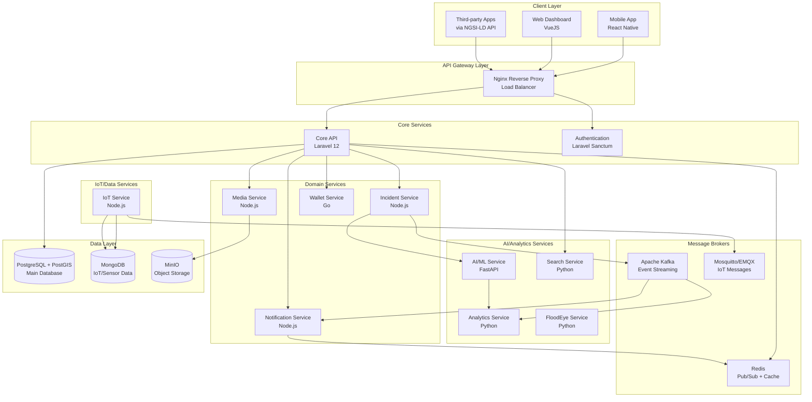
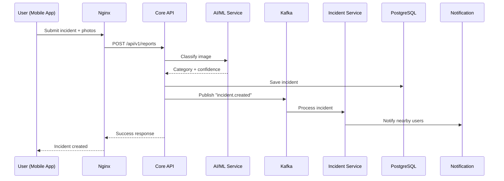
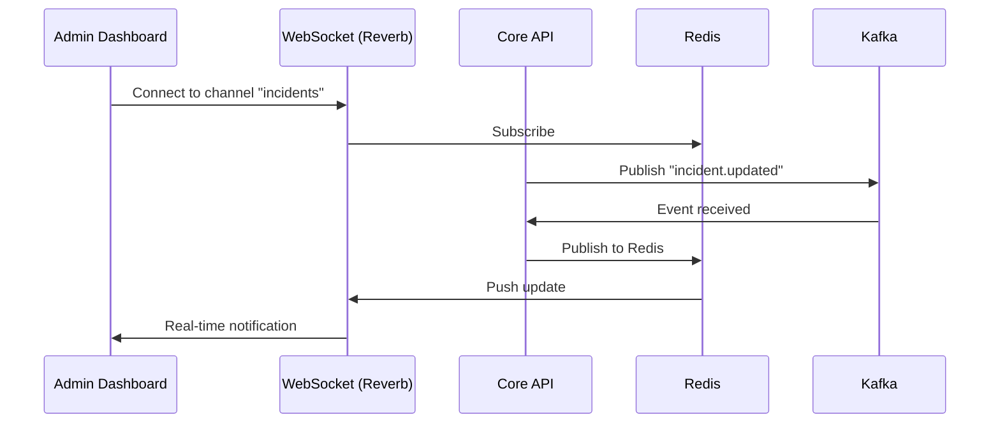
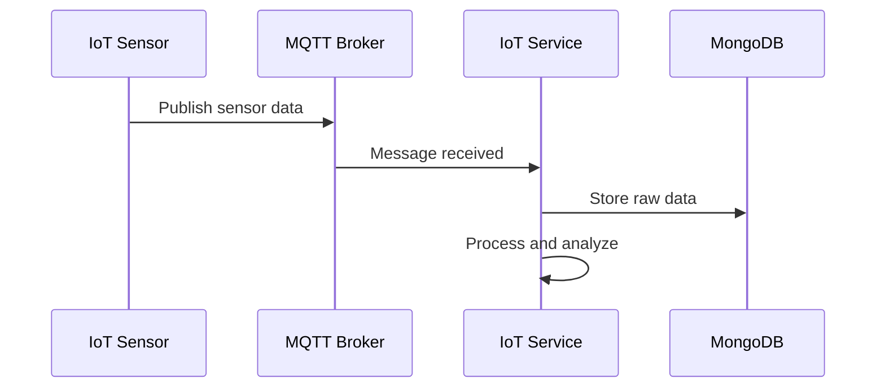

# System Architecture

**CityResQ360-DTUDZ** - Smart City Emergency Response System

---

## Overview

CityResQ360 is a **microservices-based** smart city platform that enables citizens to report urban incidents and allows government agencies to manage and respond efficiently.

### Key Features

- 🤖 **AI-Powered Detection** - Computer Vision for automatic incident classification
- 🗺️ **Real-time Mapping** - PostGIS + WebSocket for live incident tracking
- 📱 **Multi-platform** - React Native mobile app + VueJS web dashboard
- 🔗 **Linked Open Data** - NGSI-LD API for interoperability
- 🏗️ **Scalable** - Microservices architecture with independent deployment
- 🎮 **Gamification** - CityPoint reward system to encourage participation

---

## Architecture Diagram



---

## Service Breakdown

### 1. Core API (Laravel 12)
**Port:** 8000  
**Language:** PHP 8.2  
**Database:** PostgreSQL + PostGIS

**Responsibilities:**
- User management and authentication
- Incident CRUD operations
- Comment and voting system
- Admin dashboard backend
- NGSI-LD API implementation
- RESTful API for mobile/web clients

**Key Endpoints:**
- `/api/v1/auth/*` - Authentication
- `/api/v1/reports/*` - Incidents
- `/api/v1/comments/*` - Comments
- `/api/ngsi-ld/v1/*` - NGSI-LD API

---

### 2. AI/ML Service (FastAPI)
**Port:** 8003  
**Language:** Python 3.10

**Responsibilities:**
- Image classification (incident category)
- Object detection in photos
- Text analysis (NLP for descriptions)
- Priority prediction

**Models:**
- ResNet50 for image classification
- YOLO for object detection
- BERT for Vietnamese NLP

---

### 3. IoT Service (Node.js)
**Port:** 8002  
**Database:** MongoDB

**Responsibilities:**
- Collect data from IoT sensors
- MQTT message processing
- Sensor data storage
- Integration with external APIs:
  - OpenWeatherMap (weather)
  - OpenAQ (air quality)
  - OpenStreetMap (POI data)

---

### 4. Media Service (Node.js)
**Port:** 8004  
**Storage:** MinIO (S3-compatible)

**Responsibilities:**
- Image/video upload
- File optimization and compression
- Thumbnail generation
- CDN integration

---

### 5. Notification Service (Node.js)
**Port:** 8006

**Responsibilities:**
- Push notifications (FCM)
- Email notifications
- SMS alerts (future)
- WebSocket real-time updates

---

### 6. Wallet Service (Go)
**Port:** 8005  
**Database:** PostgreSQL

**Responsibilities:**
- CityPoint management
- Transaction history
- Reward calculation
- Leaderboard tracking

---

### 7. Incident Service (Node.js)
**Port:** 8001

**Responsibilities:**
- Incident workflow management
- Status updates
- Assignment to agencies
- SLA monitoring

---

### 8. Search Service (Python)
**Port:** 8007  
**Engine:** Elasticsearch (planned)

**Responsibilities:**
- Full-text search on incidents
- Geospatial search
- Faceted search (by category, date, etc.)

---

### 9. Analytics Service (Python)
**Port:** 8009  
**Database:** PostgreSQL + TimescaleDB

**Responsibilities:**
- Statistical analysis
- Trend detection
- Heatmap generation
- Report generation for government

---

### 10. FloodEye Service (Python)
**Port:** 8008

**Responsibilities:**
- Flood prediction using ML
- Water level monitoring
- Early warning system
- Integration with weather data

---


## Technology Stack

### Backend
| Service | Language | Framework | Database |
|---------|----------|-----------|----------|
| Core API | PHP 8.2 | Laravel 12 | PostgreSQL |
| AI/ML | Python 3.10 | FastAPI | - |
| IoT | Node.js 20 | Express | MongoDB |
| Media | Node.js 20 | Express | MinIO |
| Notification | Node.js 20 | Express | Redis |
| Wallet | Go 1.21 | Fiber | PostgreSQL |
| Others | Node.js/Python | - | - |

### Frontend
- **Mobile:** React Native + Expo
- **Web Admin:** VueJS 3 + Inertia.js
- **Web Public:** VueJS 3

### Infrastructure
- **Reverse Proxy:** Nginx
- **Container:** Docker + Docker Compose
- **Message Broker:** Apache Kafka, Mosquitto (MQTT)
- **Cache:** Redis 7.0
- **Storage:** MinIO (S3-compatible)

### Databases
- **PostgreSQL 15** + PostGIS - Main database
- **MongoDB 6.0** - IoT/sensor data
- **Redis 7.0** - Cache + Pub/Sub
- **TimescaleDB** (planned) - Time-series analytics

---

## Data Flow

### 1. Incident Reporting Flow



### 2. Real-time Updates Flow



### 3. IoT Data Flow



---

## Deployment Architecture

### Development
```
docker-compose.yml
├── Core API (8000)
├── AI Service (8003)
├── IoT Service (8002)
├── Media Service (8004)
├── PostgreSQL (5432)
├── MongoDB (27017)
├── Redis (6379)
├── Kafka (9092)
└── MinIO (9000)
```

### Production
```
Nginx (Load Balancer)
├── Core API (3 replicas)
├── AI Service (2 replicas)
├── IoT Service (2 replicas)
├── ... other services

Database Cluster
├── PostgreSQL (Primary + 2 Replicas)
├── MongoDB (ReplicaSet 3 nodes)
└── Redis (Sentinel 3 nodes)

Object Storage
└── MinIO (Distributed mode)
```

---

## Scalability Considerations

### Horizontal Scaling
- All services are **stateless** (except databases)
- Can add more replicas via Docker Swarm/Kubernetes
- Load balancing with Nginx round-robin

### Vertical Scaling
- PostgreSQL: Increase CPU/RAM for query performance
- AI/ML Service: GPU instances for faster inference
- Redis: Memory allocation scaling

### Database Sharding
- **By City:** Each city gets separate database (multi-tenancy)
- **By Time:** Archive old incidents to separate database

---

## Security Architecture

### Authentication
- **Mobile/Web**: Laravel Sanctum (token-based)
- **Service-to-Service**: JWT or API keys
- **NGSI-LD**: Rate limiting (no auth for GET, auth for POST/PATCH/DELETE)

### Data Protection
- **In Transit**: HTTPS/TLS 1.3
- **At Rest**: Database encryption
- **PII**: Hashed/encrypted sensitive data

### Network Security
- **Firewall**: Only ports 80, 443 exposed
- **Internal**: Services communicate via private network
- **Rate Limiting**: Nginx + Redis

---

## Monitoring & Logging

### Planned Tools
- **Metrics**: Prometheus + Grafana
- **Logging**: ELK Stack (Elasticsearch, Logstash, Kibana)
- **Tracing**: Jaeger (distributed tracing)
- **Alerts**: PagerDuty/Slack integration

---

## Future Roadmap

### Phase 2 (Post-Competition)
- [ ] Enhanced NGSI-LD API support
- [ ] Kubernetes deployment
- [ ] Multi-city support (multi-tenancy)
- [ ] Mobile app v2 with offline support

### Phase 3
- [ ] AI chatbot for incident reporting
- [ ] AR visualization of incidents
- [ ] Blockchain for transparent tracking
- [ ] Integration with government systems (LGSP)

---

**For OLP 2025 - Phần mềm nguồn mở**  
**Architecture designed for:** Scalability, Maintainability, Open Standards
